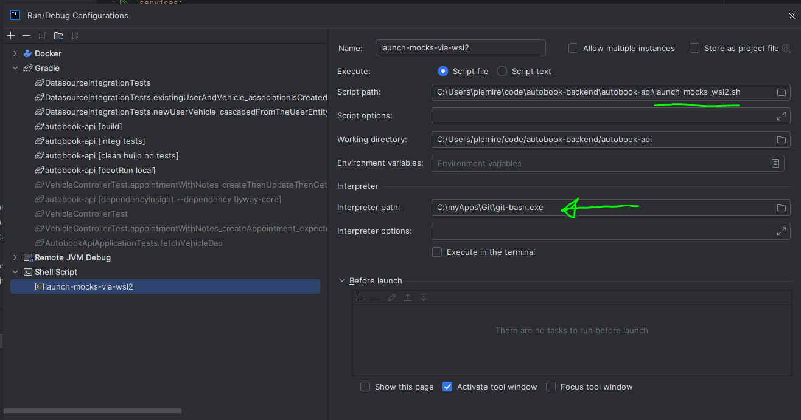
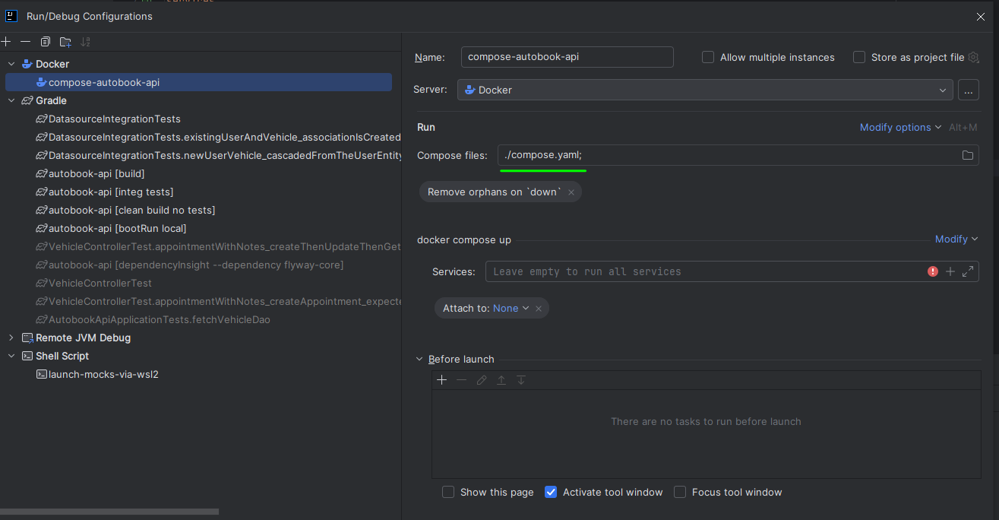
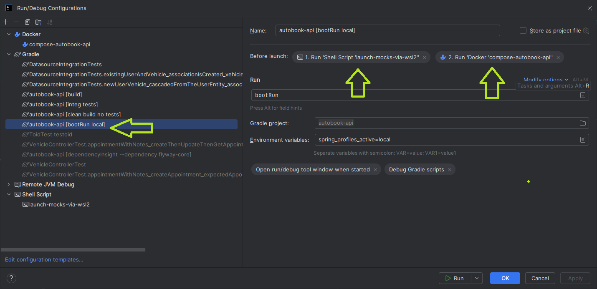

# Getting Started

## How to run this project on your local dev environment

The spring profile to use to run this project on your local dev machine is named "local".

### The idea behind the spring "local" profile
The idea behind this profile is to be able to launch the whole environment this way:
* SB API on the local machine - for convenience and performance
* Database service dockerized
* Wiremock dockerized

Provide a clean minimal database upon cluster restart and activate specific api endpoint mocks: 
This is the vision behind the use of the local profile.

### HOW TO RUN - using IntelliJ IDEA Run Configurations

#### 1. Define the wiremock shell script run config

Define a shell script run config that does run the necessary wiremock config adjustment within the wsl2 environment.

#### 2. Define the docker compose run config

#### 3. Define the gradle run config - and sequence the other run configs

Define a gradle run config that simply launches SB's bootRun task using the "local" spring profile.
Link as "before launch" the shell script run configuration and docker compose run configuration defined earlier.

THEN RUN THIS CONFIG !

