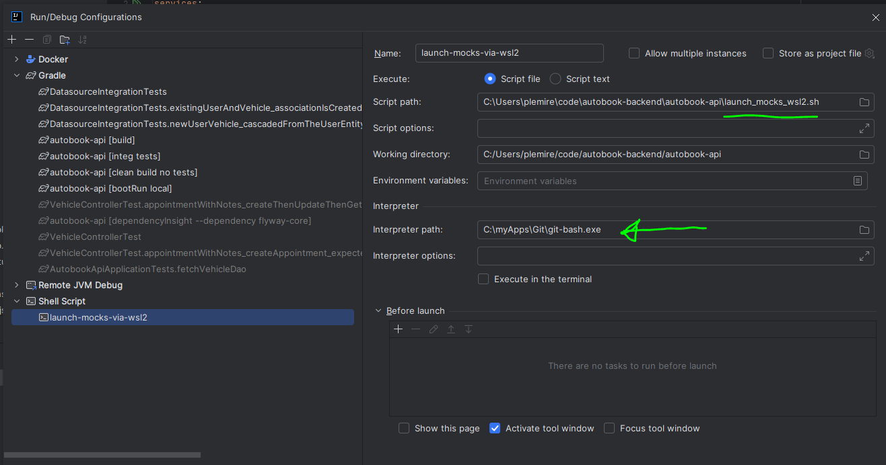
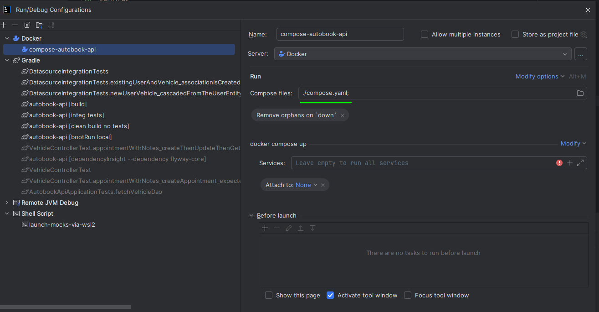

# Getting Started

## How to run this project on your local dev environment

The spring profile to use to run this project on your local dev machine is named "local".

### The idea behind the spring "local" profile
The idea behind this profile is to be able to launch the whole BE environment as a docker compose project:
* SB API dockerized - available for remote debugging
* Database service dockerized
* Wiremock dockerized

Provide a clean minimal database upon cluster restart and activate specific api endpoint mocks: 
This is the vision behind the use of the local profile.

### HOW TO RUN - using IntelliJ IDEA Run Configurations

#### 1. Define the wiremock shell script run config

For Windows:
Define a shell script run config that does run the necessary wiremock config adjustment within the wsl2 environment.

For MAC:
The shell script run config can point directly to launch_mocks.sh.

#### 2. Define the docker compose run config

The run config builds the Docker image for the SB api and launches it using the "local" spring profile.
Note: not to have to delete the Docker image for the SB api every time, specify the "Build: Always" option in the "Docker Compose Up" section.
Link as "before launch" the wiremock shell script run configuration to always keep the api mocks up to date.

THEN RUN THIS CONFIG !

